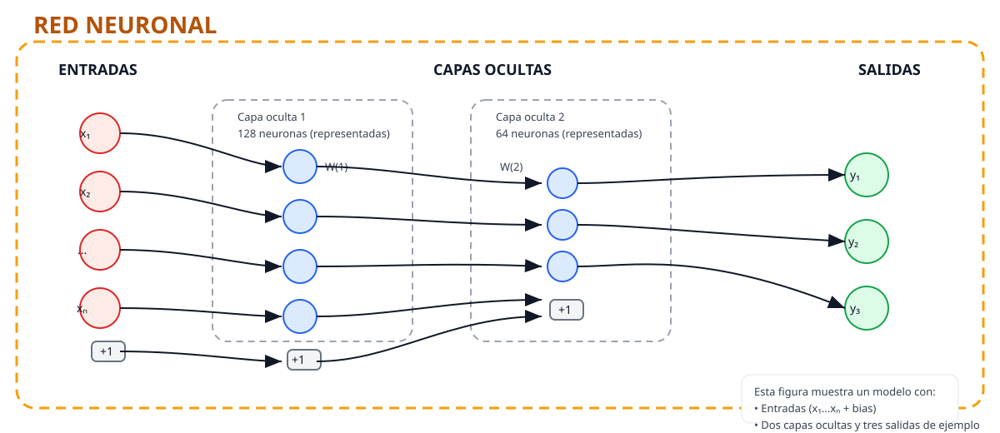

# Bogota Real Estate Machine Learning Pipeline

Proyecto modular para estimación de precios inmobiliarios en Bogotá mediante un ensamble Deep Learning (PyTorch) servido con FastAPI.

---

## Requisitos previos

- Python 3.10 o superior
- Cuenta en [Kaggle](https://www.kaggle.com)

## Estructura del proyecto

```
api-cotizador-bogota/
├── src/
│   ├── api/
│   │   ├── main.py        # Servidor FastAPI
│   │   └── schemas.py     # Modelos de entrada/salida
│   ├── config.py          # Rutas y configuración global
│   ├── data.py            # Descarga y preparación del dataset
│   ├── model.py           # Arquitectura de la red neuronal
│   ├── train.py           # Pipeline de entrenamiento
│   └── evaluate.py        # Métricas y predicción del ensamble
├── model_registry/        # Pesos y metadatos del modelo entrenado
├── requirements.txt
└── README.md
```

---

## Documentación de estructura del proyecto

- `src/config.py`: contiene las rutas y valores que usa todo el proyecto (por ejemplo, dónde se guardan los modelos). No hace cálculos, solo guarda direcciones y ajustes.
- `src/data.py`: se encarga de conseguir los datos (desde Kaggle), limpiarlos y preparar las tablas que usan los modelos. Convierte textos como el barrio o el tipo de inmueble en columnas «sí/no» que el modelo puede entender, separa los datos en conjuntos para entrenar y validar, y calcula los valores necesarios para normalizar los datos.
- `src/model.py`: define la pequeña red neuronal que aprende a estimar precios. También incluye una utilidad que detiene el entrenamiento cuando ya no mejora, para evitar entrenar de más.
- `src/train.py`: aquí se arma el proceso de entrenamiento. Entrena varias redes (cada una con una muestra distinta de los datos) para luego combinar sus resultados y obtener una estimación más estable. Al final guarda los pesos y la información necesaria para usar el modelo luego.
- `src/evaluate.py`: contiene funciones para usar los modelos ya entrenados y medir qué tan buenos son (por ejemplo, cuánto se equivocan en promedio).
- `src/api/main.py`: es la parte que convierte el modelo en una API web. Cuando arrancas el servidor carga los modelos guardados y ofrece dos cosas importantes:
  - una ruta para obtener las opciones disponibles (lista de barrios, tipos, etc.),
  - otra ruta para enviar los datos de un inmueble y obtener el precio estimado y una medida de incertidumbre.
- `src/api/templates/index.html`: una página web simple para que cualquier persona pueda probar el cotizador sin usar programación.

## ¿Cómo funciona la predicción?
1. El usuario envía datos del inmueble (tipo, área, habitaciones, baños, barrio, UPZ) a traves de https://api-cotizador-bogota.onrender.com/.
2. La API construye una fila con las mismas columnas que usó el modelo al entrenar.
3. Se aplican las mismas transformaciones que en entrenamiento para que los números estén en la misma escala.
4. Cada red del ensamble calcula su predicción; se promedian los resultados para obtener el precio final y se calcula la variación entre modelos como indicador de incertidumbre.
5. La API devuelve el precio estimado (en millones de COP) y una medida de cuán confiable es esa predicción.

## Modelo


- Entrada: recibe todos los datos del inmueble (área, habitaciones, baños y una serie de indicadores para el tipo, barrio y UPZ).
- Etapa intermedia 1: combina las entradas y las transforma en 128 números intermedios. Esto permite que la red capture relaciones entre variables (por ejemplo, cómo el área y el barrio juntos afectan el precio).
- Etapa intermedia 2: reduce esos 128 números a 64 números más compactos que contienen la información más relevante.
- Salida: a partir de esos 64 números la red calcula un solo número: la predicción del precio (transformada internamente, luego se convierte a millones de pesos).

Durante el entrenamiento la red aplica pequeñas técnicas para generalizar mejor (por ejemplo, en cada paso ignora aleatoriamente un 10% de las conexiones para no depender demasiado de ninguna característica concreta).

Además, en lugar de entrenar una sola red, el proyecto entrena varias redes con pequeñas variaciones en los datos y promedia sus respuestas. Esto suele dar estimaciones más estables y permite calcular una «incertidumbre» sobre la predicción.

### Estructura red neuronal



---
